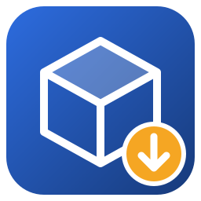

# TopSo'Linux

Run **TopSolid 7.20** on Linux, including the local PDM server, with one installer.

TopSo'Linux is a patched [Wine](https://www.winehq.org) plus an installer that sets up TopSolid from
TopSolid's installation media: **your own** copy, or downloaded from TopSolid's own server. It takes care of
everything that doesn't work out of the box under Wine: .NET, SQL Server Express, the local PDM server, the
license server and a few dozen Wine bugs.

> TopSo'Linux is an unofficial project. It is not affiliated with or supported by TOPSOLID SAS.
> You need a TopSolid license (or use TopSolid's evaluation mode).

## Tested

- **Ubuntu 26.04**, fresh installation (virtual machine): media downloaded from TopSolid's server, Gear Lever.
- **Ubuntu 24.04**, a daily-driver laptop (NVIDIA + Intel): installation from local media, updated to SP6
  with TopSolid'Update, and a real project packaged in an existing TopSolid installation and imported.

Both with TopSolid 7.20 (media 7.20.400.0 RTM).

Briefly tested, with care:

- **WSL2 on Windows** (WSLg; on the computer itself and over Remote Desktop without GPU acceleration): a
  TopSolid AppImage copied from the laptop above starts and works with a company's **PDM server and license
  server on Windows**. Known so far: TopSolid's windows can't be dragged (WSLg's window manager ignores the
  request; Windows+Shift+Up/Down still works), the start can take a minute or two longer, TopSolid hung once
  (with a TopSolid AppImage from before the watchdog of 1.2; cause not found), and a SpaceMouse needs
  `usbipd-win` to reach WSL.

## What you need

- A 64-bit Linux with glibc 2.38 or newer: Ubuntu 24.04 or newer, Debian 13, Fedora 39 or newer, ...
- The TopSolid installation media (the folder with `Setup.exe`), or let the installer download it
  from TopSolid's server (19 GB)
- About 45 GB of free disk space (65 GB when downloading the media), and an internet connection during the
  installation
- A GPU with a working OpenGL driver (NVIDIA, AMD or Intel)

## Installing

1. Download `TopSoLinux-Installer-1.6.6-x86_64.AppImage` from the [releases](../../releases).
2. Make it executable (file properties, or `chmod +x TopSoLinux-Installer-1.6.6-x86_64.AppImage`) and start it.
3. Follow the steps:
   - use the installation media found on your computer (the installer looks one folder deep in
     `~/Downloads`, your home folder and mounted drives), choose another folder, or let the installer download
     TopSolid from TopSolid's own server (the one `TopSolid.Downloader.exe` uses).
   The installer also puts TopSolid in your app menu with [Gear Lever](https://flathub.org/apps/it.mijorus.gearlever)
   and installs SpaceMouse support (spacenavd); Flatpak and Gear Lever are installed when missing. Installing
   packages asks for your password.
4. TopSolid's own installer opens. Choose the modules you use, click Install and accept the license
   agreement. **Its installation of SQL Server stops with an error. That is expected:** TopSo'Linux stops
   it and installs SQL Server itself afterwards. Close the errors and the setup.
5. Wait. The whole installation takes 30 to 60 minutes.

The result is a TopSolid AppImage (`TopSolid-7.20-TopSoLinux-1.6.6-x86_64.AppImage`; its name shows the
TopSo'Linux version that made it). Gear Lever moves it to its own folder as
`topsolid_7.20_topsolinux-1.6.6.appimage`; if Gear Lever can't be installed, it stays in `~/Downloads`.
Gear Lever names an AppImage after the app when you add it yourself; the first start puts the version back.

Without a desktop, or to script it:

```
./TopSoLinux-Installer-1.6.6-x86_64.AppImage install --media ~/Downloads/7.20.400.0_RTM \
    [--replace] [--appimage-dir ~/Applications] [--no-spacemouse]
./TopSoLinux-Installer-1.6.6-x86_64.AppImage install --download ~/Downloads/TopSolid   # download the media first
```

An interrupted installation continues where it stopped when you start the installer again. For an existing
installation, the installer offers to update the TopSolid AppImage or to replace the installation. Everything is installed in `~/.local/share/topsolinux` (set `TOPSOLINUX_HOME`
to use another folder).

### The TopSolid AppImage

The TopSolid AppImage is a complete, self-contained TopSolid. To use TopSolid on another computer,
copy the AppImage there and start it: it asks whether to **Install** it (in the app menu with Gear Lever,
which is installed too when missing) or only **Launch** it. The first start sets TopSolid up in
`~/.local/share/topsolinux` (a few minutes). Each computer needs its own license.

Only use it on computers you are licensed for, and **do not publish it**: it contains TopSolid, SQL Server
Express and Microsoft's runtimes.

**Updating TopSo'Linux:** start a newer installer and choose *Update the AppImage* (or run
`./TopSoLinux-Installer-…AppImage update-appimage [FILE]`). The TopSolid AppImage gets the newer Wine and
starter, and the new TopSo'Linux version in its name; your installation and projects stay, and so does the
installation inside the AppImage.

TopSolid's service packs are installed with TopSolid'Update (right-click the icon). They update the
installation in `~/.local/share/topsolinux`, not the AppImage file, so Gear Lever's update button does not
apply to it.

## First start

TopSolid asks for the PDM connection: choose **Local PDM Server** and leave user and password empty. Then add
the libraries you need from TopSolid. The first start of the local PDM can take a few minutes; TopSo'Linux
shows what it is doing until TopSolid shows its own splash screen.

**Command Prediction** is off in a new installation: it trains a neural network in the background all the
time (here 1.4 processor cores and 10.6 GB, against 0.5 cores and 3.3 GB without). Turn it on in TopSolid's
options if you want it.

## Everyday use

Right-click TopSolid's icon in the app menu for TopSolid'Update, the license tool, Wine settings and
*Stop background services*. The AppImage also accepts commands:

| Command | |
|---|---|
| *(none)* | start TopSolid |
| `update` | start TopSolid'Update (service packs) |
| `license FILE` | install a license file |
| `license-tool` | TopSolid's license tool |
| `scale 150` | text and icons at 150% (100 = normal), kept until changed |
| `scale auto` | follow the desktop's scale again (the default) |
| `stop` | stop SQL Server, the PDM and the license server |
| `debug` | TopSolid hangs: write its stacks to `~/topsolid-debug-….txt` for a bug report (stops nothing) |
| `winecfg`, `regedit`, `shell` | Wine tools, for troubleshooting |

TopSolid follows the scale of your desktop by itself, unless you set one with `scale` or in Wine's settings.

Numbers and units follow the *Formats* of your desktop (Settings → Region & Language), not its language:
with Dutch formats on an English desktop, TopSolid stays English but uses a decimal comma, and with a metric
region new documents use millimetres. To set them yourself, start `regedit` and change `sDecimal`,
`sThousand`, `sList` and `iMeasure` (0 metric, 1 US) in `HKEY_CURRENT_USER\Control Panel\International`;
values changed there are kept.

Environment variables: `TOPSOLID_SCALE=150` (same as `scale`), `TOPSOLID_GPU=nvidia|default`
(laptops with NVIDIA and Intel/AMD graphics use the NVIDIA GPU automatically).

Resize a window: hold Super and drag with the middle mouse button, or press Alt+F8.

### SpaceMouse

The installer installs and starts [spacenavd](https://spacenav.sourceforge.net) (or do it yourself:
`sudo apt install spacenavd`). TopSo'Linux includes
a replacement for 3Dconnexion's navigation library that talks to spacenavd, so no 3Dconnexion driver is
needed. Axis directions and speeds are in the registry (`regedit`,
`HKEY_CURRENT_USER\Software\Wine\TDxNavLib`): `AxisSigns`, `AxisMap`, `TranslationSpeed`, `RotationSpeed`.

## Troubleshooting

- Logs: `~/.local/share/topsolinux/install.log` (installation) and `topsolid.log` (TopSolid).
- "Unable to connect to the PDM server" right after starting: wait a minute, the PDM is still starting.
  If it stays, run the `stop` command and start again.
- Everything hangs: `stop` stops all background services.
- Don't run two TopSolid installations at the same time: they use the same ports for SQL Server, the PDM
  and the license server.
- **Virtual machines:** TopSolid's 30-day evaluation mode does not start in a virtual machine
  ("UNLICENSED", protection key "Unavailable"): its license protection refuses virtual machines.
  With a real license it works. Without a GPU, TopSolid switches off graphics acceleration.
- Ubuntu: don't install the package `fuse` for AppImages, it removes parts of the desktop. What AppImages
  need is already there.

## How it works

The installer:

1. creates a Wine environment; installs fonts, Visual C++ 2019 and .NET 4.0 with winetricks, and .NET 4.8
   and 3.5 from TopSolid's media,
2. runs TopSolid's own `Setup.exe` from the media,
3. installs SQL Server Express from the media without the Windows Update check that fails under Wine,
   and the license server and TopSolid'Update if the setup skipped them,
4. finishes SQL Server's configuration (its setup still fails at the very end under Wine: registry,
   system databases, file locations, a login for the Windows administrators group, TCP port 14330),
5. performs the first start of the local PDM server (it only starts the first time while TopSolid's
   PDM server admin tool is running) and waits until its database is complete,
6. makes the TopSolid AppImage and adds it to Gear Lever.

While TopSolid runs, a small watchdog keeps its dialogs from hanging in an endless repaint under Wine,
such as the PDM "Connection" dialog of the first start or a command's dialog (`installer/tools/unstick.c`
explains why).

Wine needed 51 changes for TopSolid, from COM security, WMI and NTLM authentication for SQL Server to
certificate handling, services, painting, tooltips, a thread leak and a SpaceMouse bridge. They are in
`wine/patches`, on top of the upstream commit in `wine/UPSTREAM_COMMIT`. They are not submitted to Wine:
Wine does not accept AI-generated code (see below).

## Building

```
wine/build-wine.sh build/wine-dist     # patched Wine (needs Wine's build dependencies and MinGW)
./build.sh build/wine-dist             # the installer AppImage
```

`build.sh` also needs `x86_64-w64-mingw32-gcc`, `ntlm_auth` (package `winbind`), `cabextract`,
`winetricks` and `curl`, and bundles `ntlm_auth`, `cabextract` and `winetricks`. With the .NET SDK
(`dotnet`, or `DOTNET=path/to/dotnet`) it also builds the tool that reads the managed stacks for `debug`.

## Guide

A short user guide: [docs/topsolinux-guide.pdf](docs/topsolinux-guide.pdf).

## How this was made

Completely vibe coded: every line of the Wine patches, the installer, the tools and this documentation
was written by **Claude Opus 5.5** (Anthropic) in Claude Code, directed and tested by a TopSolid user who wanted
TopSolid on a Linux desktop. Read the code with that in mind.

## License

The TopSo'Linux scripts and tools: MIT. The Wine patches: LGPL 2.1 or later, like Wine.
See [NOTICE.md](NOTICE.md) for trademarks and bundled software.
